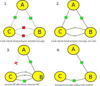

# scalable secure scuttlebutt

This is notes on a paper for ssb.

## assumptions about social networks

TODO: find refrences to justify this assumption.

* _power law assumption_: we expect activity to follow a power law.
(a small proportion of users are update very frequently,
a large number, only infrequently)

* _tendency for local connections_: if you are "friends" with a peer
it's likely that another friend is also a friend.

* _hub connections assumption_: short paths to hubs: some users are "hubs", being connected
with a large number of other peers. Paths to even distant users
are short due connections via hubs. It's highly likely that
someone you know follows any given celebrity.

For simplicity, we model the following replication protocol designs in the context of connected random swarms.
In practice, we do not want a design that replicates all messages in the entire network (especially because
we intend it to scale to millions of users). For social media applications, users view the feeds of they
have explicitly followed/friended. However, due to the strongly connected nature of the social graph
(they primary way people meet is being introduced to friend of friends) the chance of having a considerable
overlap in your follow graph with any friends is quite high. Thus, the simpler to model random network is a reasonable
approximation to friend replication in a real social network - how good this approximation is is discussed in
**TODO: write this** section.

## data models

We use a simple data model that fits fairly well any social media application.
the main resource is a _feed_, which is an append-only log of _messages_.
Each feed has strictly a single author. Each peer is the publisher of their own feed,
and the subscriber to zero or more other feeds.

Each feed is an append-only log of messages, and each message contains
the id of the feed, an always incrementing sequence number, and some content.
(also, the hash of the previous message and a signature, but this paper focuses
on the performance of our design, not the security, so we can leave that out for now)

```
Feed f = [{id:f.id, sequence, content},...]
```

A peer is usually the author of at least one feed, but may be a "lurker" who does not post.
In this paper we can assume that each peer is the author of one feed and that the peer's id
is also the id of that feed.

Each peer is also a subscriber to their own, and zero or more other feeds.

```
Peer p = {id:p.id, feeds: { <id>: [msg,...] }}
```

## comparison of replication algorithms.

Starting with the simplest, develop models of data replication.
>I basically just made up the O() notations... maybe this should be based on simulations instead?
especially since some of my arguments depend on a certain factor
being limited somewhat (by the nature of networks)

## polled scan: (RSS) Really Simple Syndication

A publisher (`pub`, of type `Peer`) hosts content, and a subscriber (`sub`, also of type `Peer`)
connect and the publisher sends their content.

At each request, the publisher sends the entire feed.

> (footnote: In practice, RSS truncates the feed and may not send older messages,
so isn't provably eventually consistent, we've analyzed a simplified version,
which has provable eventual consistency.)

This is extremely simple to implement at the server end (RSS provides an xml file over http)
and slightly more complex at the client end, as clients append only the new values.
It's assumed that messages are fairly small, text only, and large files are referenced as some sort of link.

When a subscriber connects, the publisher replies `received = pub.feeds[pub.id]`
(which means sending `pub.feeds[pub.id].length` messages)
the subscriber then appends any new messages to their copy of that feed.
`sub.feeds[pub.id].append(received[sub.feeds[pub.id].length...])` such that both copies of the feed are the same,
that is, contain copies of the same messages. `sub.feed[pub.id] == pub.feed[pub.id]`

new messages are published over time, and so the subscriber periodically makes a request to each publisher.

```
interval(sub.pollFrequency, () => sub.feeds.each(id => sub.connect(id)) )
```

So, every `sub.pollFrequency` all publishers are connected to and all messages from them are downloaded,
old messages end up being sent many times unnecessarily, so the amount of bandwidth needed scales very badly.

bandwith needed for a subscriber can be calculated as the following:

> (footnote: assume that `pollFrequency` is number of polls
within the given timeframe that we are calculating resource usage for. The important thing is how many polls are made.
If we were to calculate usage per day, and there was one poll per day, pollFrequency is 1. In any case, we are
more interested in exploring the relationship between the various design factors and resources used, so the important
thing to observe here is that the total resource used is _multiplied_ by `pollFrequency`, doubling `pollFrequency` doubles
the number of messages sent)

```
total_messages = sum(map(sub.feeds, id => sub.feeds[id].length))
sub.pollFrequency*total_messages
```
each interval, the subscriber polls every publisher, and receives all messages.
Hense the total set of messages is redownloaded every interval.

and for the publisher,

```
subscribers = sum(peers, peer => peer.feeds[pub.id] ? 1 : 0 ))
avg_poll_frequency = sum(peers, peer => peer.feeds[pub.id] ? peer.pollFrequency : 0 )) / subscribers

subscribers*avg_poll_frequency*pub.feed[pub.id].length
```

Clients have a tradeoff between bandwidth and latency. Either they use lots of bandwidth
or wait a long time for new messages. So this design is not suitable for realtime communication.

For publishers, this design also suffers from uncontrollable expenses. If there are suddenly
many subscribers, or they set their pollFrequency very high, this increases costs for the
publisher, which in practice will lead to outages. Thus the most popular content is the most
likely to be unavailable, which is the opposite of what is needed.

Also, this model uses a network connection per poll, is likely to be a
limiting factor for publishers with large numbers of subscriptions.

the total number of network connections over some time period
is for the subscriber:

`avg_poll_frequency * sub.feeds.length`

and the publisher

`poll_frequency * subscriptions`

## append-only poll

Messages in a feed have a total order defined by an always increasing
value such as a sequence, such that any message's sequence is strictly greater
than any preceding message. If the sequence number of the first message is 1,
then the number of messages in the feed (`feed.length`) is also the sequence number of the last item.

> (footnote: By sending messages in order, if a transmission fails part way,
the requester's copy of the feed is still a valid append only log with no gaps - but their latest
message is just not the true latest message. Next time they connect they will receive the missing messages.)

Instead of sending all messages per poll, the subscriber requests all messages greater
than the sequence number of the latest message they currently have.
This requires sending on a tiny header (the sequence number)
and the publisher only sends each message to each subscriber once.

the publisher expects a sequence number, and returns any messages greater than that.
```
pub.serve(n => pub.feeds[pub.id][n...])
```

the subscriber connects to a pub, and appends the messages the pub returns to their copy,

```
received = sub.connect(pub.id, sub.feeds[pub.id].length)
sub.feeds[pub.id].append(received)
```
now the subscriber is consistent with the publisher.

> (footnote: the publisher sends the messages in order, so if a connection fails part way
through, the subscriber's copy still has sequential messages

The cost for the subscriber is as follows

```
sub.pollFrequency * sub.feeds.length + total_messages
```

This is a significant improvement over polled-scan because each message is only downloaded once.
However, the subscriber must still send their current sequence number to each publisher, on each poll.
Although we can resonably assume that the sequence number is significantly smaller
than a message, if the pollFrequency or sub.feeds.length is high this can become significant.

The number of connections needed are the same as polled scan.

For a suddenly popular publisher, many incoming requests can still lead to availability problems,
as the simple number of requests becomes overwhelming, although because the entire feed of messages
does not need to be sent the practical limit is much higher.

## append-only gossip (scuttlebutt)

In a gossip protocol, instead of subscribers polling publishers,
"peers" which can be both publisher and subscriber, connect to each other randomly.
On each connection, peers send a map of their subscriptions -> latest sequence for that feed,
and then if either peer has a more recent messages for any given feed, they send them to the other peer.

Since a connection now sends the list of subscriptions,
but only needs to connect to a single peer each poll interval,
more bandwidth is used per connection, but less connections are used.
the overall bandwidth used by a peer is the same as with append-only poll,
but the number of connections is now only `O(poll_frequency)`

```
peer.serve(clock => mapValues(clock, (id, sequence) => peer.feeds[id][sequence...]))
```

to connect a particular random peer, the connecting peer a map of `{<id>:<length>,...}`
and receives a list of messages

```
each(
  peer.connect(random_peer.id, map(peer.feeds, id => peer.feeds[id].length )),
  (msg) => peer.feeds[msg.id].append(msg)
)
```

Because messages are no longer passed directly from the publisher to each subscriber,
describing the time needed to disseminate a new message is more complicated.
In the first poll interval, the publisher will be connected to at least 1 other peer.
(the publisher makes 1 outgoing connection, but may receive any number of incoming connections)
If it gets passed to only a single peer, but in the second poll interval, there are now two peers able
to disseminate the message. If they do not connect again, in the 3rd interval
there will be 4 peers, and so on in powers of 2. However, as the number of peers
with a given message increases the chance that any two connecting peers already both have the
message increases too, and the rate of disemination decreases. Thus overall rate
of disemination resembles an S curve. Since calculating the actual rate of disemination
is more complicated, and is affected by practical matters such as the probability that
more that multiple peers connect a particular peer at once, instead of calculating
the time, we take measurements from a simple simulation.

The pattern of disemination of a single message is the same as flooding gossip.
for a random network with 10,000 peers and each peer creating a connection to one
other peer randomly each interval (so a given peer may receive zero or more incoming connections,
but makes only one out going connection), the total number of intervals needed
to diseminate a single message is very small compared to the number of peers.

```
round, dR, dT
1, 9, 10
2, 51, 61
3, 293, 354
4, 1195, 1549
5, 3903, 5452
6, 3875, 9327
7, 666, 9993
8, 7, 10000
```

In amazon dynamo, this protocol design is used to replicate
membership information within a cluster of dynamo nodes.
The peers run inside a trusted enviroment, and all peers replicate
all other peers. To add a peer to the network, that peer just
needs to know any other peer. It's not necessary to inform
any master node, and the cluster is highly resilient.

This design has a significant advantage with availability.
If a peer that originated a message goes offline, if they
have diseminated a message to at least one other peer that message
will continue to flood the network. If a publisher suddenly
becomes very popular, it will not cost them extra resources,
because it's the other peers which will provide the disemination.

However, this does have the drawback that this design is only
usable in applications were the set of subscribers to any one publisher
are reasonably known. However, I agrue that the probability of sharing
mutual interests and mutual friends is high, this is a reasonable assumption
for social network applications.

## append-only gossip with request skipping

In practice, activity in most datasets follows a power law.
some authors are highly prolific, but most only publish rarely.
Thus, it is likely that when two peers exchange a vector clock in
append-only gossip, the majority of feeds mentioned have not changed.
The chance that no new messages are sent during a connection increases
with poll_frequency.

_request-skipping_ is an optimization to avoid making feed requests if it seems unlikely
that a feed has changed, it requires storing the received clock from remote peers,
but saves sending many headers after the first connection.

On the first connection between two peers, the entire clock is sent, but on subsequent connections,
the current clock is compared with the stored copy of the remote clock, and only the feeds that differ are sent.

```
//first connection
local_clock = map(peer.feeds, id => peer.feeds[id].length )
//take the stored remote clock, or an empty clock if this is the first connection.
remote_clock = peer.clocks[remote.id] || {}
conn = peer.connect(remote.id)

conn.send(filter(local_clock, (id, seq) => remote_clock[id] != IGNORE && remote_clock[id] != seq))

remote_clock2 = conn.recv()
remote_clock = peer.clocks[remote.id] = merge(remote_clock, remote_clock2)

//if they have requested feeds we did not send, send our current seq for those feeds.
conn.send(map(
  filter(remote_clock2, (id, seq) => local_clock[id] != seq),
  id => local_clock[id] or IGNORE
))

//finally, send any needed messages
conn.send(mapValues(remote_clock, (id, seq) => if local_clock[id] > seq && seq != IGNORE then peer.feeds[id][seq...]))
each(conn.recv(), msg => peer.feeds[msg.author].append(msg))
```

`IGNORE` is a special value used to indicate that the remote has requested a feed that we choose not to replicate.
It is necessary to make a definite response in this case, because this enables the remote to remember we are not interested
in this feed, and so they will avoid requesting this feed next time they respond.

Once we receive the remote's clock and have compared it to the stored copy,
we can calculate everything that needs to be send or received. In practice,
long lived connections are used, and we allow new clocks to be sent at any time,
but for simplicity of describing the algorithm we represent it here as having 5 phases:
send initial clock, receive remote clock, send response clock, send messages, receive messages.

> (footnote: It is essential that we only update our record of the remote clock with data they have explicitly sent
us, and _not_ based on the messages we have sent them. It is possible that a connection fails before
our peer receives a message, but if they send us something we know they ment it.)

If peers A and B are consistent with respect to feed X, neither will mention X the next time they connect.
However, if either peer receives a new message in X, one of them will mention it and the other will respond,
and the first will send the message. If both receive the new message before they next reconnect, they'll both
mention it, but see they are at the same message and not send it.

If peer A requests a feed id X that B has not chosen to replicate, B receives `X:<seq>` from A,
and will reply with`X:IGNORE`.
A will store `A.clocks[B.id][X] = IGNORE`, and B will store `B.clocks[A.id][X] = <seq>`.
IGNORE is never sent in the initial clock, only in the response. If B later chooses to replicate X,
the next time they connect to A, they'll check their current sequence (which will be 0 at the time they choose
to replicate X),
against the stored clock for B. They'll see that it's different and send `X:0`
in the initial clock. A will then see that B is no longer ignoring X, and will respond with their
sequence for X. If B doesn't change their mind about X, A will never mention it again.

> (footnote: in the case that B decides to replicate X, but somehow ends up with the same sequence
that A has for X, then they won't mention it, however, sooner or later, they will receive a new
message in X from someone else, and after this will mention it to A)

The worst case, for two given peers exchanging a single feed, is when the poll frequency
is greater or equal to the frequency that new messages are added. This means that each
peer sends a vector clock element for every message added to that feed, so the maximum
number of vector clock elements is the same as the number of messages sent. If the poll
frequency is lower than the message frequency, efficiency increases as each vector clock
element will correspond to potentially many messages. Since this at worse a constant
factor of the number of messages, it's within acceptable bounds and poll frequency can be
selected for maximum availability without trading off bandwidth usage.

It is expected that in practice, message frequency differs greatly by feed.
request skipping saves sending vector clocks elements for infrequently updating
feeds, so a great deal less vector clock elements need be sent than in append-only gossip,
especially when using high poll frequencies.

`messages + peers_connected_to*peer.feeds.length + peer.pollFrequency/messages`

There is now only one multiplicative factor in the bandwidth complexity.
We must send the entire vector clock to each peer that we will connect to,
the first time we connect to them. However, luckily, to get provable eventual
consistency, we do not actually need to connect to every peer. As messages
are relayed, we only need the eventual connections to form a connected graph,
_not_ for each peer to eventually connect. Consequently, a value for
`peers_connected_to` can be somewhat smaller than the whole swarm.

Simulating random networks with varying numbers of random connections, the
measured probability that the graph is fully connected rapidly approaches 1
as the average number of connected peers passes 2. As the number of edges
continues to rise, the distance across the graph (and thus disemination rate)
drops.

```
edges, P(connected), average, stdev
1, 0.05, 57.26, 19.385365614297818
1.1, 0.46, 23.33, 2.549725475418886
1.2, 0.69, 18.1, 1.6763054614240047
1.3, 0.7, 15.08, 1.188949115816149
1.4, 0.8, 13.52, 1.2765578717786399
1.5, 0.91, 12.33, 0.8130805618141443
1.6, 0.9, 11.45, 0.82915619758885
1.7, 0.96, 10.59, 0.8011866199581761
1.8, 0.97, 9.83, 0.6333245613427602
1.9, 0.99, 9.29, 0.4958830507287036
2, 1, 8.72, 0.5306599664568481
3, 1, 6.91, 0.2861817604250792
5, 1, 5.39, 0.48774993593029137
10, 1, 4.59, 0.4918333050943186
20, 1, 4, 0
```

I would suggest using a fixed number of connections per peer in the range 5-10,
would effectively gaurantee a fully connected network, and small disemination rate,
without scaling the number of full vector clocks to be sent by very much.

Also note, this design requires storage of vector clocks, so reducing the number
of peers connected to also keeps that within acceptable bounds.

## overlapping replication sets

So far, we have analyzed the problem space as if all peers under consideration
are replicating the same set of publishers. In some application designs it
may make sense for all peers to replicate the same set of feeds, for example,
in a task tracking system within a medium sized company or other organization.
On the other hand, the really interesting use-cases are ones that scale to millions
of users, and so it might not feasible to replicate all their data on the average device,
even if you did want to. In secure-scuttlebutt, the target application is a social network.
This provides an interesting middle ground, with both a fair amount of overlap and a
reasonable expectation of it. Since one of primary ways that people meet new friends
is by meeting friends of friends. These encounters might be more or less formal,
but never the less, the chance that any two friends have a number of mutual friends in
common is fairly high.

In the most conservative design, it might be desired to replicate only the direct
friends "followed" by the user. If the follow graph is known, a set of replication
peers can be carefully selected to ensure coverage of all follows. For each feed
a remote peer follows that the local peer does not, an feed id and IGNORE will be sent,
but after that, subsequent requests for that feed will be skipped.

In the current secure-scuttlebutt design, by default peers replicate their friends,
and the friends of their friends. Sampling the actual ssb data, choosing 5 random
peers to replicate, and replicating feeds two hops out on the follow graph (friends,
and friends of friends), in all samples, the all the direct friends of the user were
within 2 hop range of the 5 random peers, also on average ~75% (TODO: GRAPHS THESE)
of friends of friend were replicated by at least one peer. Since in ssb, this could
be more carefully optimized, peers selected carefully to maximize coverage, but also,
since request skipping means we'll only send headers for unreplicated feeds one time,
we can just connect to more random feeds and still get acceptable efficiency.

## realtime broadcast

It is obviously desirable that a communication network would
carry messages quickly. For human to human text communication,
latency within a few seconds is usually sufficient. However,
most of the above replication strategies would be unviable
with `poll_frequency` of a few seconds, not to mention, establishing
a TCP connection has overhead, and several extra messages must be
passed to make that an encrypted TCP connection. So, instead of
simple polling, we should have connections with a longer lifespan -
when a new connection is formed we exchange clocks and receive any
old messages we are mssing, via the above polling algorithms,
but then we "stay on the line", and if our peer receives any
additional messages they send those too.
Thus, we our model becomes _sync then broadcast_.

In the non-gossip models, we must eventually connect to every
peer we subscribe to. It would be unviable to hold long term
connections to every peer, as they may number in the thousands,
and the overhead of a each connection would be too much for
most user devices. But with gossip, we can connect to just a small
number of peers at a time and still receive messages from many peers.

## random connected network

N peers are randomly connected with average K outgoing connections per peer.
(outgoing, because each peer randomly chooses to connect to K other
peers) as discussed in the previous section, the chance that the network
is fully connected rapidly approaches 1 when as K approaches 2, and
then the average shortest path between nodes shortens as redundant connections increase.
For the network to broadcast a message, the originating peer sends it to all
neighbouring peers, and when a peer receives a _new_ message,
 they send it to all their connected peers except the peer they received
the message from. Consider a network with 3 peers and 2 connections each.
A creates a new message and transmits a message to B and C, and B and C then
transmit the message to each other. Thus the message is sent twice
by A and once each by B and C. The total bandwidth used by the
network is 4. Since A creates the message and there are only
two other peers, only the transmissions to B and C are necessary,
but B and C don't know that the other already has the message.

simulating a broadcast in a random network with up to 20 connections
per peer, and measuring hops, average hops, messages transferred

|K|peers|hops|avg|msgs|inefficiency|
|-|-----|----|---|----|------------|
|1|1000|14|6.657|999|1|
|2|1000|7|3.657|2981|2.984|
|3|1000|6|2.944|4947|4.952|
|4|1000|5|2.842|6913|6.92|
|5|1000|5|2.605|8861|8.87|
|6|1000|5|2.515|10803|10.814|
|7|1000|4|2.388|12731|12.744|
|8|1000|4|2.361|14671|14.686|
|9|1000|4|2.306|16605|16.622|
|10|1000|4|2.193|18487|18.506|
|11|1000|4|2.201|20357|20.377|
|12|1000|4|2.136|22237|22.259|
|13|1000|4|2.118|24163|24.187|
|14|1000|4|2.118|25993|26.019|
|15|1000|4|2.027|27877|27.905|
|16|1000|4|2.008|29709|29.739|
|17|1000|4|2.046|31567|31.599|
|18|1000|4|1.994|33393|33.426|
|19|1000|4|1.94|35281|35.316|
|20|1000|4|1.933|37135|37.172|

> note, with 1000 peers and one connection we only need to send
999 messages because the first peer is the author of the message
and did not need to send it.

Note, with more than one connection, number of hops (which is
the time taken for the last message to arrive) decreases slowly,
but the average case, time for 50% of the network to receive the message,
decreases much quicker and the (bandwidth)
inefficiency increases fastest.
With K=2, nearly 3 times as many messages as necessary are sent.
and with K=5, nearly 9 times too many messages are sent!

So with a simple flooding design, we pay a lot in bandwidth for reducing latency.

If we were to prune the redundant connections, we could get low latency
without bandwidth overhead. However, since a pure spanning
tree has no redundency it's also very fragile. If one connection close
to the root of the tree (the originator of a message) fails, all downstream
peers will be cut off.

## spanning trees

Epidemic broadcast trees is an algorithim to form a spanning tree from
a random network, but instead of completely removing redundant connections,
they are just moved into a _lazy_ or _pull_ state. When in the lazy state,
only headers (equivalent to vector clock elements) are sent. Which connections
are redundant can be detected by each peer observing the order in which they
first receive a message. And thereafter observing latency. For example, in the
3 node network discussed in the previous section, A transmits a message to B and C,
neither of them have received this message before, so they know that their connection
to A is not redundant. Then, they each receive a second copy of the message from B,C
so they both know that for messages from A, the connection between B-C is redundant.
So, B and C exchange short messages each requesting the other to disable that connection (for messages from A). When A broadcasts another message, B and C receive
it directly from A again, but since the redundant connections are disabled, they do not
transmit it again. Instead, they only send a short message, equivalent to a vector clock
element, to indicate they know this message exists. If later, the connection between
A and C breaks, and A broadcasts another message. It will only be received by B.
B then sends the short lazy check to C, who then realizes that this is the first they
have heard about this message - theirfore, B must now be closer to the source than they are.
C then sends a message to rerequest active transmission of messages from A, and B sends
the message to C. (note, reestablishing an active connection takes just one roundtrip)



EBT still sends redundant data, but the notes sent along the redundant connections
are significantly smaller than the messages. Also, if a delay is introduced,
it is not necessary to send a note for every message, but just the latest message.
If several are received in quick succession, only one note needs to be sent.
Also, if a random factor, somewhat greater than round trip time is added,
then 50% of the time the same note is received before it is sent.

For example, B and C receive the message from A at approximately the same time,
if B decides to wait one second, and C waits two seconds, and the note from B to C arrives in
0.1 seconds, C knows that B already knows about that message, and now does not need to send a note back.

# singleton hub

> note: to make the strongest arguement for the performance of ebt+request skipping,
> compare it to a fully centralized model.

To this point, most social networks have been implemented
along a star shaped network. Essentially one peer that distributes
all messages to all peers. If this was designed around a replication
protocol, a client would use something like the append-only poll,
except the server would remember each client's vector clock at each timestamp,
all their subscriptions, and the client would only send the time the last synced.
The server would then send all new messages on any of their subscriptions.

On each connection, the client needs to send their last connection time,
and the server still has to send each message. If a client polls at low rate,
the client sends one header and receives many messages. If the client
polls at a high rate, maybe they make one request per message. (long lived
connections would also help here)

they would request the sequence number representing
their own read feed, on each connection they'd request any messages
that have occured since the last connection, but the central server
still has to send the messages.

`O(poll_frequency + messages)`

the central server of course, must pay for a lot of resources

bandwidth:
`O(network_clients*poll_frequency + peers*messages)`
and connections:

`O(network_peers*poll_frequency)`

If a network is successful, network_clients can easily get very very
large. millions or billions of clients.

## conclusion

An idealized centralized network is presented as the best possible in efficiency,
yet it only beats our design by a constant factor. Between EBT with a fixed number
of peers and request-skipping, we can manage the bandwidth performance, but the main difference
is only in vector clock elements, which are very small compared to messages.

In the current secure-scuttlebutt implementation, which uses base64 encoded strings to
encode 256 bit public keys plus a base 10 integer, vector clock elements are about 60 bytes,
and the average message is 660 bytes (although maximum message is 8kb) so the average message is 11 times
bigger than a single vector clock element.

I would expect, that for a typical peer, most messages would be replicated after being offline for a while,
so one vector clock element brings in many messages. For messages replicated in real time,
the extra bandwidth used is managed by limiting the number of connections.

The performance of our design is close enough to the optimal centralized system to realistically
argue that it's viable at massive scale. In practice, we believe that small difference will easily
be made up by all the other advantages by adopting a decentralized system.
For example, the significant costs associated with running such a system are now spread around the
network participants evenly. With a fully decentralized gossip protocol, peers can join in any
topology. If two peers are offline, but nearby each other, it is possible for them to share data
directly over bluetooth, wifi, or by directly exchanging physical media. This means secure-scuttlebutt
is potentially able to service remote areas of the earth that have not yet received modern infrastructure,
as well as areas where that infrastructure is disrupted by warfare or other disasters.


